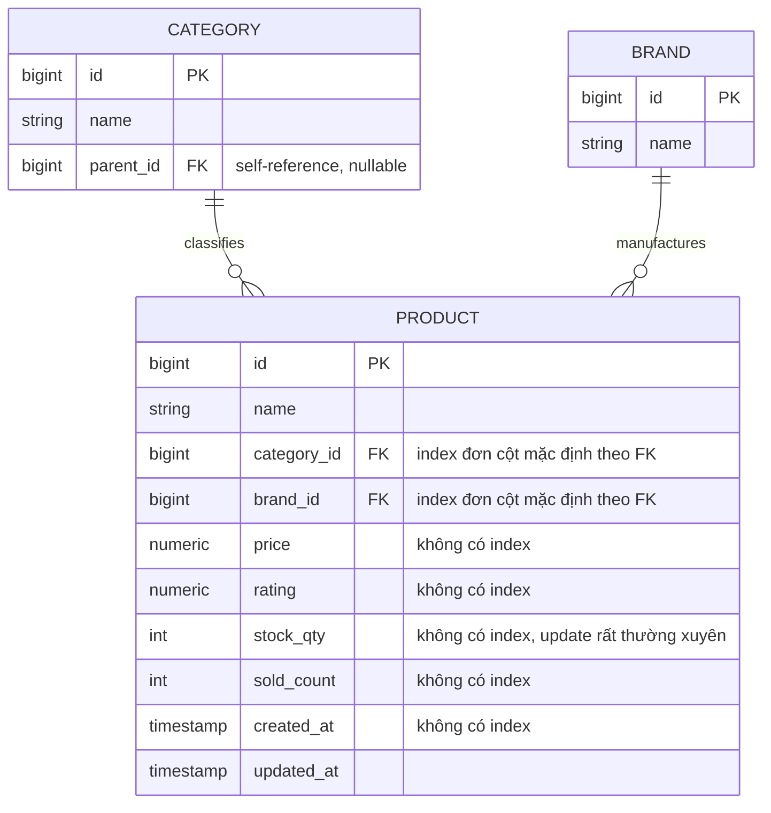

# Base ERD - Catalog sản phẩm trước khi tối ưu index

Đây là trạng thái **base**, tức trước khi áp đề bài. Catalog service đã có 3 entity cốt lõi: Product, Category, Brand, với bảng `products` chứa trực tiếp giá và tồn kho (đúng như đề bài mô tả "giá và tồn kho trên bảng products"). Ở trạng thái này, `products` chỉ có index mặc định (primary key) và các index đơn cột tự sinh theo khoá ngoại (category_id, brand_id) — chưa có bất kỳ composite index, partial index hay covering index nào phục vụ riêng cho các tổ hợp filter/sort mà đề bài sẽ yêu cầu tối ưu.

Ghi chú: chưa có composite index (category+brand+price), chưa có partial index (lọc còn hàng), chưa có covering index, và chưa có cơ chế tách free-text search hay keyset pagination — đây chính là khoảng trống mà đề bài sẽ lấp vào.
