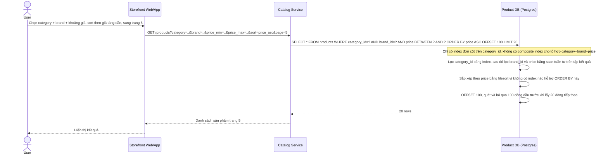

# Base sequence - Browse catalog với filter/sort cơ bản

Đây là trạng thái **base**. Flow này mô tả cách user browse catalog, kết hợp filter (category, brand, price) và sort (giá tăng dần) cùng phân trang OFFSET, khi DB chưa có composite index hay keyset pagination. Flow này được chọn vì nó chính là hiện trạng "chưa tối ưu" mà đề bài yêu cầu cải thiện: DB phải scan/filesort và OFFSET quét bỏ dòng ở trang sâu.

Điểm nghẽn ở đây (thiếu composite index cho filter/sort phổ biến, filesort, OFFSET quét bỏ dòng ở trang sâu) chính là 3 vấn đề đề bài nêu ra cần giải quyết bằng index và keyset pagination.
