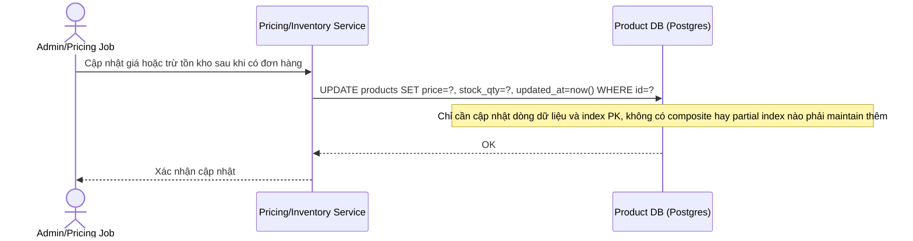

# Base sequence - Update giá và tồn kho

Đây là trạng thái **base**. Flow này mô tả việc cập nhật giá/tồn kho trên bảng `products` diễn ra rất thường xuyên (real-time, nhiều lần/giây ở sản phẩm hot), khi DB chưa có index bổ sung nào cần maintain ngoài PK. Flow này được chọn vì đề bài đặt ra yêu cầu cân bằng giữa số lượng index phục vụ đọc và overhead ghi — cần thấy rõ chi phí ghi ở base (thấp) để so sánh với enhance (cao hơn do thêm index).

Chi phí ghi ở base rất thấp vì gần như không có index phụ, nhưng đổi lại là tốc độ đọc/filter/sort kém như thể hiện ở flow browse-catalog-filter-sort.
