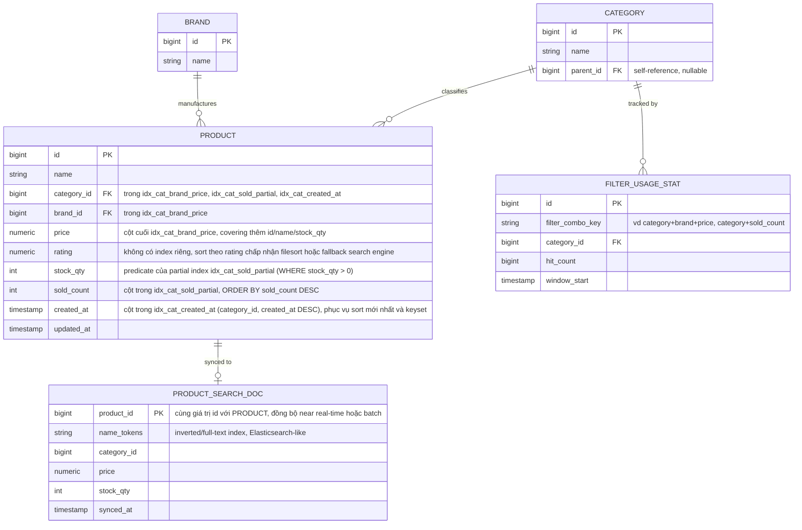

# Enhance ERD - Catalog sau khi áp chiến lược index

Đây là trạng thái **enhance**, tức nguyên văn đề bài đã áp dụng lên base. Vẫn giữ 3 entity Category/Brand/Product, nhưng bảng `products` giờ được gắn một tập composite/partial/covering index được chọn lọc dựa trên tần suất filter/sort thực tế (không tạo tràn lan). Thêm 2 entity mới để phục vụ các fallback mà đề bài yêu cầu: `PRODUCT_SEARCH_DOC` (search index riêng cho free-text tên sản phẩm, khi B-tree không đáp ứng tốt) và `FILTER_USAGE_STAT` (dữ liệu phân tích tần suất tổ hợp filter, làm căn cứ chọn composite index nào nên tạo, tổ hợp nào chấp nhận chậm hơn).

So với base: thêm 3 composite/partial index có mục tiêu (`idx_cat_brand_price`, `idx_cat_sold_partial`, `idx_cat_created_at`) thay vì index tràn lan cho mọi tổ hợp, thêm `PRODUCT_SEARCH_DOC` để tách free-text search khỏi B-tree, và thêm `FILTER_USAGE_STAT` làm căn cứ dữ liệu cho quyết định "index nào phổ biến, tổ hợp nào hiếm nên fallback".
