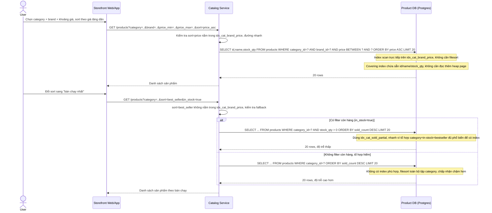

# Enhance sequence - Browse catalog với filter/sort được index hỗ trợ

Đây là trạng thái **enhance** của flow browse-catalog-filter-sort. So với base, flow này thay đổi ở chỗ: Catalog Service giờ biết phân biệt tổ hợp sort nào được composite index hỗ trợ trực tiếp (price, nằm cuối `idx_cat_brand_price`) và tổ hợp nào không (bán chạy, rating) để chọn đường đi phù hợp — dùng partial index nếu có filter còn hàng, hoặc chấp nhận filesort chậm hơn cho tổ hợp hiếm, đúng chiến lược "vài composite index phổ biến nhất + fallback cho tổ hợp hiếm" mà đề bài yêu cầu.

