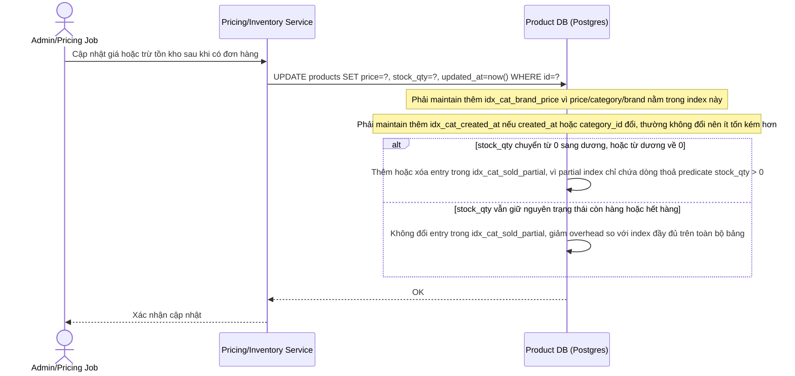

# Enhance sequence - Update giá và tồn kho với overhead index mới

Đây là trạng thái **enhance** của flow update-price-stock. So với base, flow này thay đổi ở chỗ: mỗi lần ghi giờ phải maintain thêm các composite/partial index mới tạo (`idx_cat_brand_price`, `idx_cat_created_at`, `idx_cat_sold_partial`), đúng với đánh đổi mà đề bài nêu ra giữa số lượng index phục vụ đọc và overhead ghi trên bảng products được cập nhật real-time. Partial index được thiết kế để giảm bớt overhead này bằng cách chỉ chứa các dòng còn hàng.

So với base, chi phí ghi tăng lên do phải maintain 2-3 composite/partial index thay vì chỉ PK, nhưng đây là đánh đổi có chủ đích: chỉ giữ vài index phổ biến nhất (dựa trên `FILTER_USAGE_STAT`) thay vì tạo index cho mọi tổ hợp filter có thể có.
