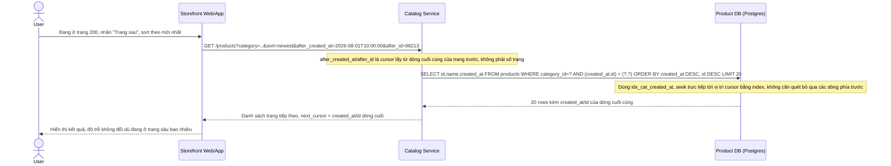

# Enhance sequence - Keyset pagination cho phân trang sâu

Đây là trạng thái **enhance**, mô tả 1 flow hoàn toàn mới phát sinh từ đề bài: chưa từng tồn tại ở base (base chỉ có OFFSET pagination). Flow này được chọn vì đề bài yêu cầu rõ chuyển từ OFFSET sang keyset pagination (dựa trên giá trị cột index cuối cùng đã thấy) để giữ độ trễ ổn định khi user phân trang sâu (page 200+), thay vì để DB quét và bỏ qua toàn bộ dòng phía trước.

Khác biệt cốt lõi so với OFFSET ở base: DB không còn phải đếm và bỏ qua N dòng đầu, mà seek thẳng tới vị trí trong index nhờ điều kiện `(created_at, id) < (cursor_created_at, cursor_id)`, nên độ trễ ổn định bất kể phân trang sâu tới đâu.
