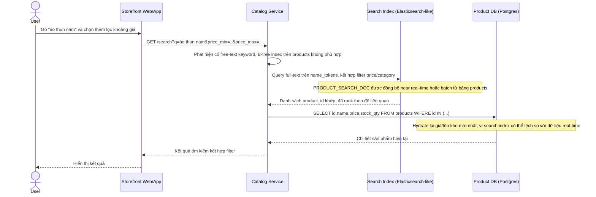

# Enhance sequence - Tìm kiếm từ khóa kết hợp filter

Đây là trạng thái **enhance**, mô tả 1 flow hoàn toàn mới phát sinh từ đề bài: chưa tồn tại ở base vì base chưa có nhu cầu free-text search, chỉ filter theo cột có cấu trúc. Flow này được chọn vì đề bài yêu cầu xác định ranh giới rõ ràng: khi user gõ từ khóa tên sản phẩm kết hợp filter, B-tree index không đáp ứng tốt free-text nên phải tách sang search index riêng (Elasticsearch-like), rồi hydrate dữ liệu mới nhất (giá, tồn kho) từ DB chính.

Ranh giới rút ra: mọi truy vấn chỉ filter/sort trên cột có cấu trúc vẫn đi qua composite/partial index trên `products` như các flow browse-catalog-filter-sort, còn ngay khi có free-text keyword thì route hẳn sang Search Index, không cố gắng LIKE '%...%' trên B-tree.
