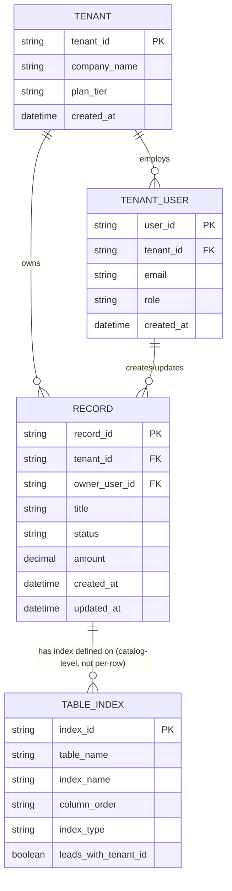

# ERD — Base (trước khi chuẩn hoá index đa tenant)

Đây là **base**: mô hình dữ liệu suy luận cho hệ thống SaaS B2B multi-tenant dùng shared schema *trước khi* áp các quy tắc tối ưu index của đề bài. Đề bài giả định đã tồn tại `TENANT`, `TENANT_USER` và một bảng dữ liệu nghiệp vụ dùng chung `RECORD` (đại diện cho loại bảng "shared table" bất kỳ — invoice, lead, ticket... — có cột `tenant_id`, quy mô lệch lớn giữa các tenant) — nếu không có các entity này thì việc "tối ưu index cho truy vấn đa tenant" sẽ không có nghĩa. ERD còn đưa `TABLE_INDEX` vào như metadata catalog (kiểu `pg_indexes`) để thể hiện đúng vấn đề gốc: ở base, thứ tự cột trong composite index KHÔNG được chuẩn hoá nhất quán — cột `leads_with_tenant_id` có giá trị hỗn hợp tuỳ theo index được tạo bởi tính năng nào, dẫn tới rủi ro full table scan nêu trong đề bài.

