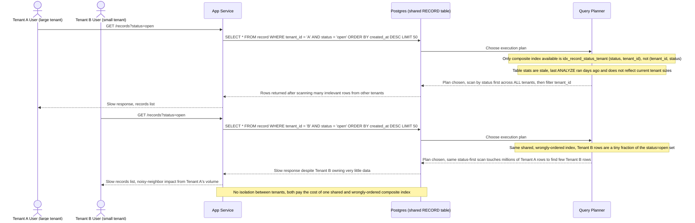

# Sequence Diagram — Base: Tenant Query Records

Đây là **base**, flow "tenant truy vấn danh sách dữ liệu của mình" trên bảng `RECORD` dùng chung. Flow này được chọn vì nó chính là nạn nhân trực tiếp của 2 vấn đề đầu tiên trong đề bài: composite index không đặt `tenant_id` đầu tiên (một tính năng cũ tạo `idx_record_status_tenant (status, tenant_id)` sai thứ tự) và độ lệch dữ liệu lớn giữa các tenant khiến planner chọn plan tệ. Diagram cho thấy cả tenant lớn lẫn tenant nhỏ đều bị ảnh hưởng, kể cả khi chỉ một bên có nhiều dữ liệu.

