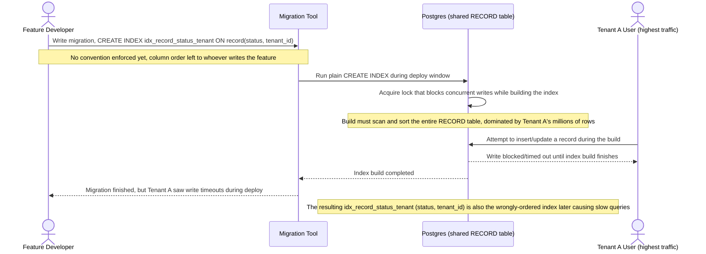

# Sequence Diagram — Base: Add Index Migration

Đây là **base**, flow "thêm index mới cho một tính năng" theo cách làm cũ. Flow này được chọn để làm tiền đề đối chiếu trực tiếp với yêu cầu cuối của đề bài (migration online, không khoá ghi) — ở base, chưa có quy ước bắt buộc dùng `CREATE INDEX CONCURRENTLY` lẫn quy ước bắt buộc `tenant_id` phải là cột đầu, nên migration này vừa khoá bảng vừa vô tình tạo ra chính cái index sai thứ tự đã gây chậm ở flow truy vấn.

