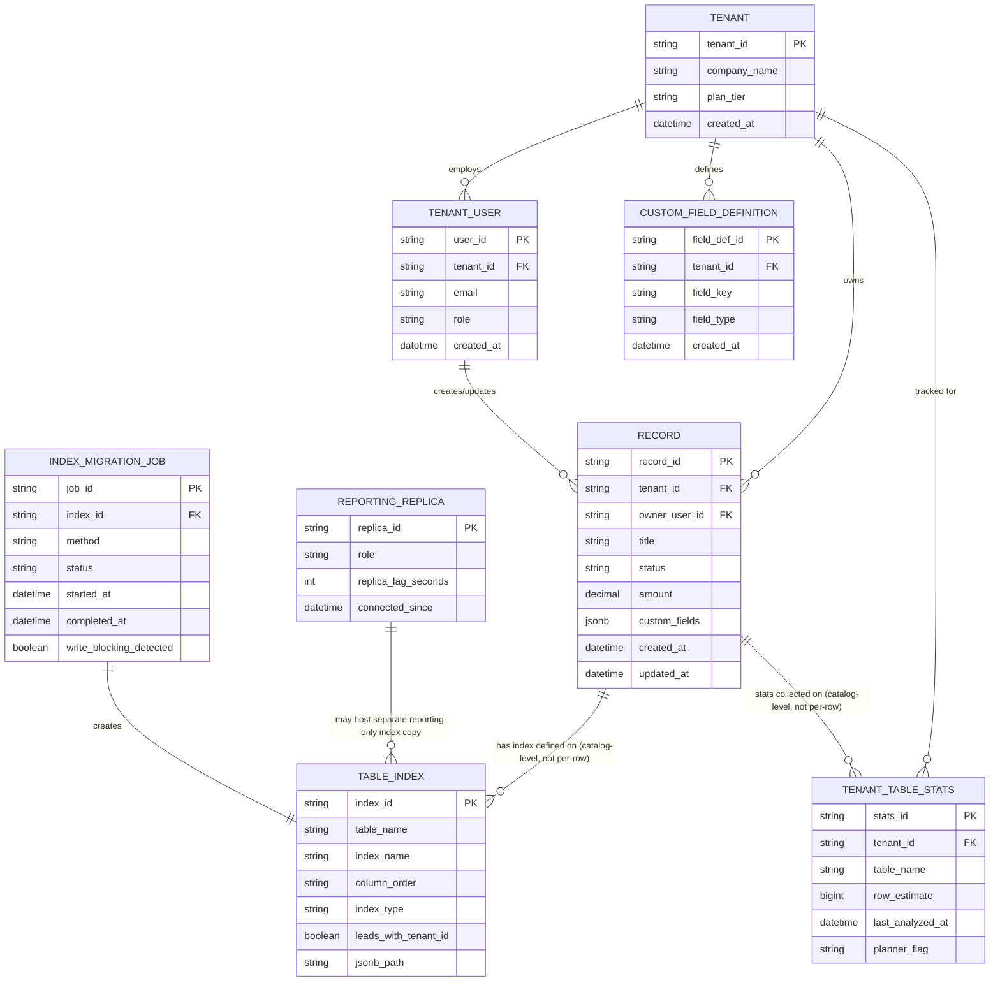

# ERD — Enhance (sau khi chuẩn hoá index đa tenant)

Đây là **enhance**: ERD base cộng thêm các entity/cột phục vụ đúng 5 yêu cầu của đề bài. So với base, `TABLE_INDEX` được bổ sung cột `jsonb_path` và quy ước `leads_with_tenant_id` nay luôn là true cho mọi composite index (yêu cầu 1); `TENANT_TABLE_STATS` là entity mới theo dõi thống kê ANALYZE theo từng tenant để xử lý độ lệch cardinality (yêu cầu 2); `RECORD` có thêm cột `custom_fields JSONB` cùng entity `CUSTOM_FIELD_DEFINITION` cho phép tenant tự khai báo field động (yêu cầu 3); `REPORTING_REPLICA` tách index/luồng report nặng khỏi luồng giao dịch (yêu cầu 4); `INDEX_MIGRATION_JOB` ghi nhận việc build index luôn chạy online, không khoá ghi (yêu cầu 5).

