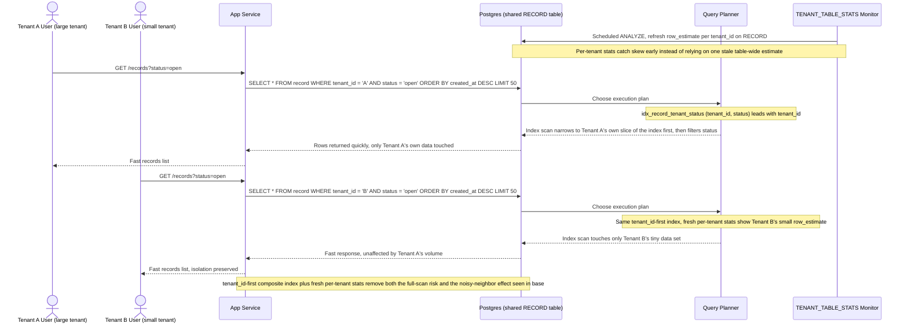

# Sequence Diagram — Enhance: Tenant Query Records

Đây là **enhance** của flow đã có ở base ("tenant truy vấn danh sách dữ liệu của mình"). So với base, flow này thay đổi ở 2 điểm: composite index nay là `idx_record_tenant_status (tenant_id, status)` — `tenant_id` luôn đứng đầu (yêu cầu 1) — và thống kê `TENANT_TABLE_STATS` được refresh định kỳ theo từng tenant để planner không còn bị đánh lừa bởi độ lệch cardinality (yêu cầu 2). Kết quả là cả tenant lớn lẫn tenant nhỏ đều chỉ chạm vào đúng dữ liệu của mình.

