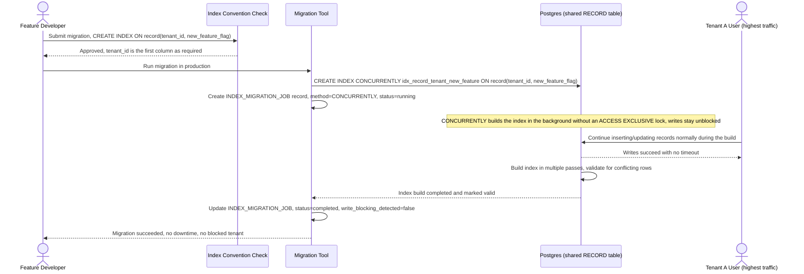

# Sequence Diagram — Enhance: Add Index Migration

Đây là **enhance** của flow đã có ở base ("thêm index mới cho một tính năng"). So với base, flow này thay đổi ở 2 điểm: có bước review bắt buộc kiểm tra `tenant_id` là cột đầu tiên trước khi cho migrate (yêu cầu 1), và migration luôn chạy bằng `CREATE INDEX CONCURRENTLY`, được `INDEX_MIGRATION_JOB` theo dõi để đảm bảo không khoá ghi kể cả với tenant có traffic cao nhất (yêu cầu 5) — trái ngược hoàn toàn với base, nơi migration dùng `CREATE INDEX` thường và khoá bảng suốt quá trình build.

