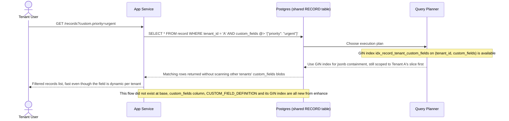

# Sequence Diagram — Enhance: Filter Custom Fields

Đây là **enhance**, flow hoàn toàn mới chưa tồn tại ở base: tenant lọc dữ liệu theo custom field lưu trong cột `custom_fields JSONB` dùng chung. Flow này được chọn vì thể hiện trực tiếp yêu cầu 3 của đề bài — B-tree không hiệu quả cho field động này, nên cần GIN index (kết hợp `tenant_id` để không quét chéo dữ liệu tenant khác trong cùng cột JSONB dùng chung).

