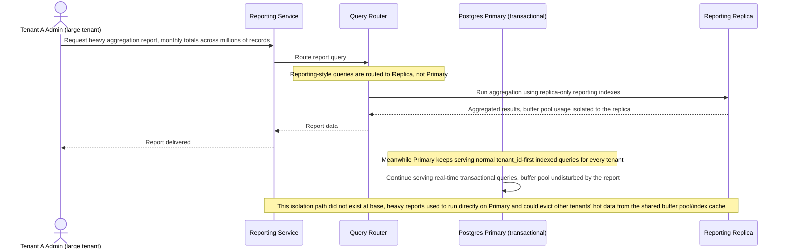

# Sequence Diagram — Enhance: Run Heavy Report

Đây là **enhance**, flow hoàn toàn mới chưa tồn tại ở base: một tenant lớn chạy report/aggregation nặng trên `REPORTING_REPLICA` thay vì trên bảng transactional chính. Flow này được chọn vì thể hiện trực tiếp yêu cầu 4 của đề bài — tách index/replica riêng cho luồng reporting nặng, để tenant nhỏ khác không bị chậm theo do buffer pool/index cache dùng chung bị tenant lớn chiếm dụng.

