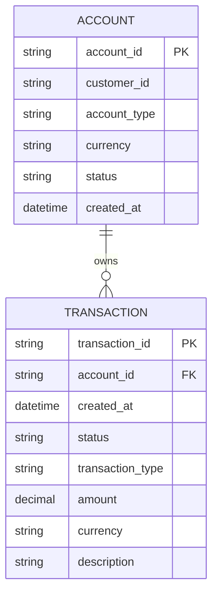

# ERD - Base: bảng transactions cơ bản, chưa tối ưu index/partition

Đây là **base**, trạng thái dữ liệu ngay trước khi áp đề bài. Hệ thống ngân hàng số/ví điện tử đã có `ACCOUNT` và bảng `TRANSACTION` append-only lưu mọi giao dịch, nhưng bảng chưa được partition và chỉ có index tối thiểu (khóa chính trên `transaction_id`, index đơn cột trên `account_id`) - đây chính là điểm xuất phát mà đề bài (composite index, partial index, partition, read replica) cần cải thiện.

