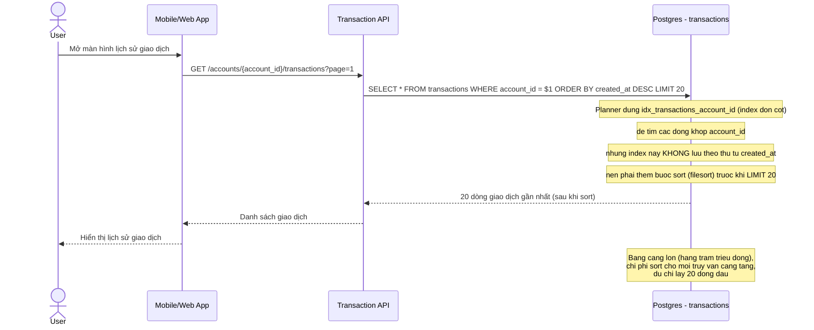

# Sequence - Base: User tra cứu lịch sử giao dịch

Đây là **base**, flow "user tra cứu lịch sử giao dịch của tài khoản mình". Flow này được chọn vì đây chính là truy vấn mà đề bài muốn tối ưu bằng composite index `(account_id, created_at DESC)` - ở base, bảng chỉ có index đơn cột trên `account_id` nên DB phải tự sort kết quả, minh hoạ rõ vấn đề cần giải quyết.

