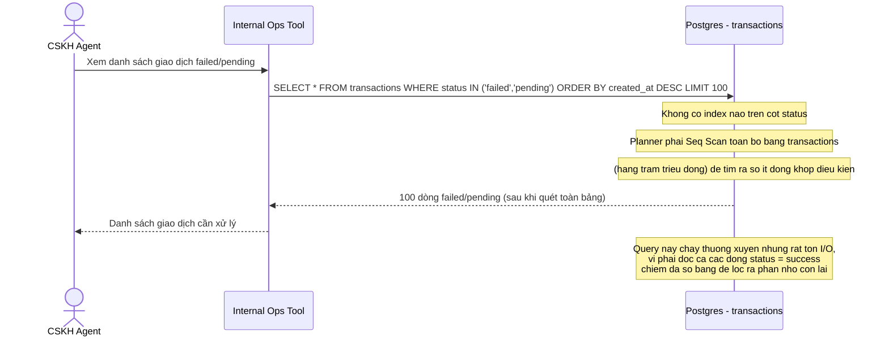

# Sequence - Base: CSKH lọc giao dịch failed/pending

Đây là **base**, flow "CSKH tra cứu toàn bộ giao dịch failed/pending để xử lý sự cố". Flow này được chọn vì đề bài đề xuất partial index cho đúng use case này - ở base, bảng chưa có bất kỳ index nào trên cột `status`, nên minh hoạ vấn đề: dù số dòng failed/pending chỉ là phần rất nhỏ, DB vẫn phải quét toàn bộ bảng.

