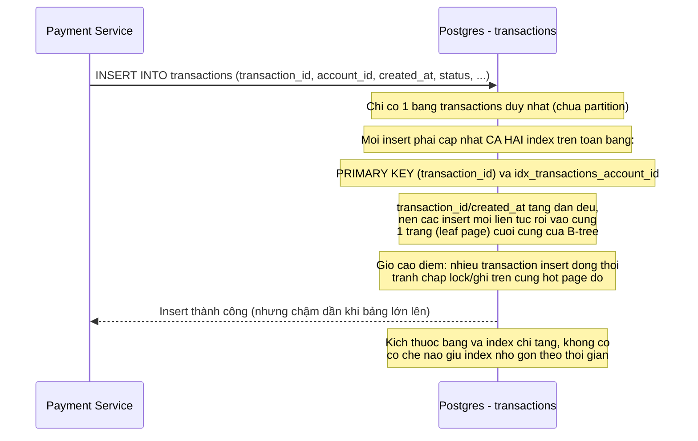

# Sequence - Base: Insert giao dịch mới (append-only)

Đây là **base**, flow "hệ thống thanh toán insert giao dịch mới vào bảng transactions". Flow này được chọn vì đề bài nhắc tới 2 vấn đề trực tiếp liên quan tới insert: (1) B-tree của bảng đơn (chưa partition) ngày càng phình to làm chậm ghi và bảo trì index, (2) giờ cao điểm insert đồng thời vào cột tăng dần (created_at/id) gây hot page ở cuối B-tree.

