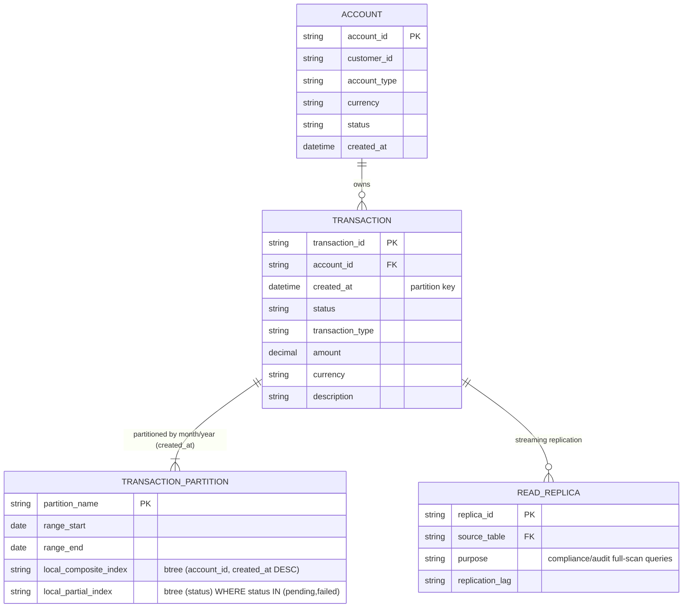

# ERD - Enhance: transactions range-partition + partial index + read replica

Đây là **enhance**, đúng nguyên văn nội dung đề bài. So với base, bảng `TRANSACTION` logic nay được range-partition theo tháng/năm dựa trên `created_at`, mỗi partition mang bộ index riêng nhỏ gọn (composite `(account_id, created_at DESC)` cho user, partial index theo `status` cho CSKH), và có thêm `READ_REPLICA` tách riêng cho compliance/audit để không cạnh tranh tài nguyên với luồng giao dịch thời gian thực.

