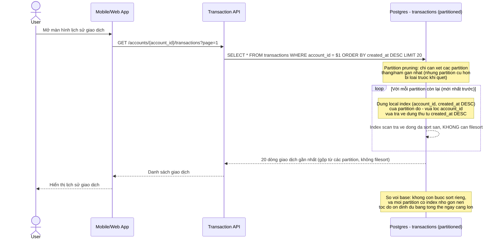

# Sequence - Enhance: User tra cứu lịch sử giao dịch

Đây là **enhance** của flow "user tra cứu lịch sử giao dịch" đã có ở base (file `2-base-user-transaction-history-lookup-sqd.md`). So với base, DB không còn phải filesort: bảng đã range-partition theo `created_at` nên planner prune bớt partition không liên quan, rồi dùng local composite index `(account_id, created_at DESC)` của từng partition còn lại để lấy dữ liệu đã sẵn đúng thứ tự.

