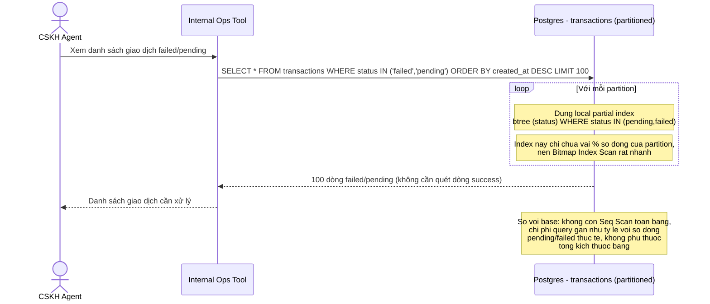

# Sequence - Enhance: CSKH lọc giao dịch failed/pending

Đây là **enhance** của flow "CSKH lọc giao dịch failed/pending" đã có ở base (file `3-base-cskh-filter-failed-pending-sqd.md`). So với base, mỗi partition nay có sẵn partial index chỉ chứa các dòng `status IN (pending, failed)`, nên thay vì Seq Scan toàn bảng, DB chỉ cần Bitmap Index Scan trên partial index rất nhỏ của từng partition.

