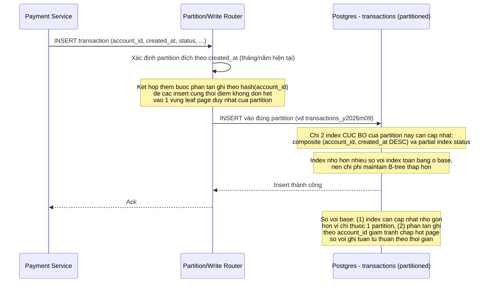

# Sequence - Enhance: Insert giao dịch mới (partition + giảm hot page contention)

Đây là **enhance** của flow "insert giao dịch mới" đã có ở base (file `4-base-insert-transaction-sqd.md`). So với base, insert nay chỉ cần cập nhật index của đúng 1 partition (nhỏ gọn hơn nhiều so với index toàn bảng cũ), và có thêm bước phân tán ghi theo `account_id` để giảm tình trạng nhiều transaction cùng tranh chấp một hot page ở cuối B-tree trong giờ cao điểm.

