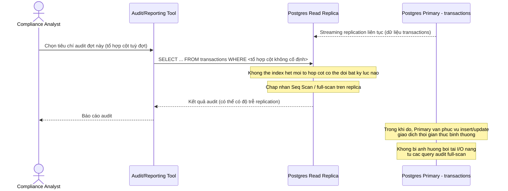

# Sequence - Enhance: Compliance chạy audit query trên read replica

Đây là **enhance**, flow hoàn toàn mới phát sinh từ đề bài, chưa tồn tại ở base. Bộ phận compliance cần chạy các query full-scan với tổ hợp cột thay đổi liên tục theo từng đợt kiểm toán, không thể index hết - flow này tách các truy vấn đó sang read replica riêng để không cạnh tranh index/buffer pool với luồng giao dịch thời gian thực (OLTP) trên primary.

