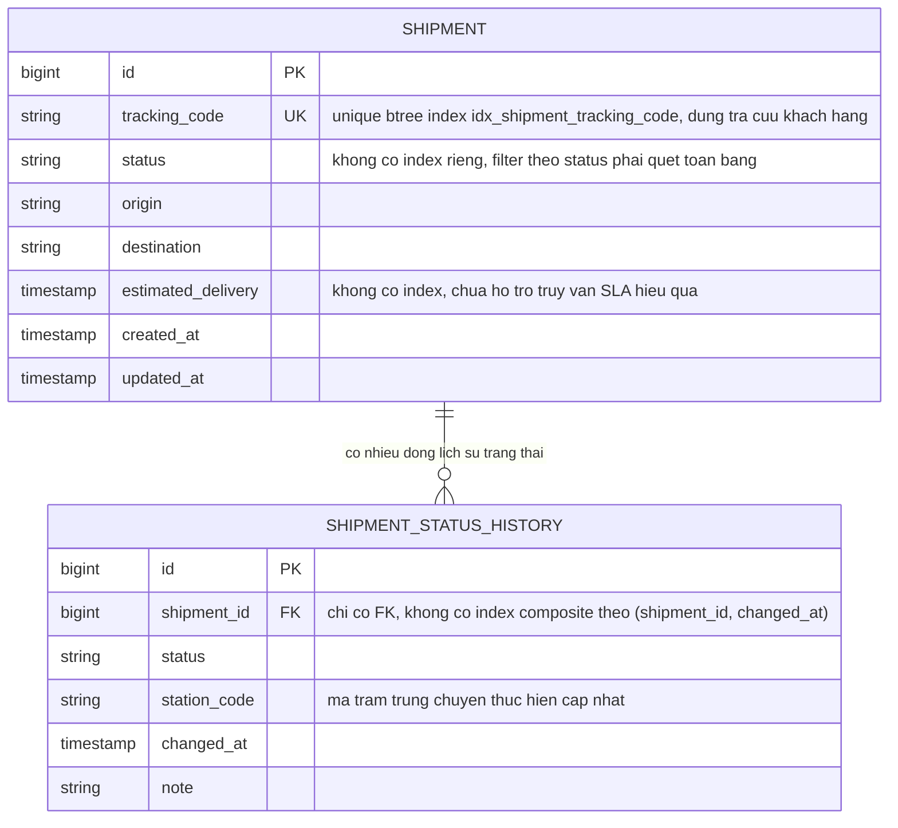

# Base ERD - Quản lý vận đơn cơ bản

Đây là **base**: trạng thái dữ liệu trước khi áp đề bài tối ưu index. Hệ thống đã có bảng `shipments` với unique index trên `tracking_code` để tra cứu tức thời, và bảng `shipment_status_history` lưu lịch sử thay đổi trạng thái, nhưng **chưa có** partial index cho status, chưa có composite index (shipment_id, changed_at) cho lịch sử, và chưa có index riêng phục vụ truy vấn cảnh báo SLA - đây chính là những khoảng trống mà enhance sẽ lấp vào.

