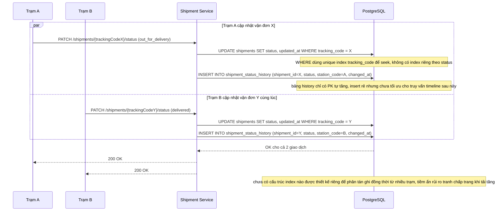

# Base - Flow trạm cập nhật trạng thái vận đơn

Đây là **base**, sequence diagram cho flow **update-shipment-status**: một trạm trung chuyển ghi nhận thay đổi trạng thái cho vận đơn. Flow này được chọn vì đây chính là nguồn ghi tần suất cao mà đề bài tập trung tối ưu index xung quanh nó (partial index status, composite index history, tránh hot page khi nhiều trạm ghi đồng thời).

