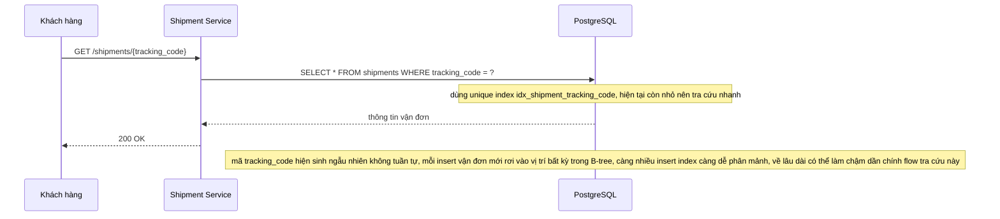

# Base - Flow khách tra cứu theo mã vận đơn

Đây là **base**, sequence diagram cho flow **lookup-by-tracking-code**: khách hàng tra cứu vận đơn bằng mã tracking_code. Flow này được chọn vì nó là lý do unique index trên `tracking_code` tồn tại ngay từ base, và là flow phải luôn giữ nhanh dù bảng bị ghi liên tục - chính là mối lo mà đề bài nêu ở yêu cầu sinh mã tracking_code thân thiện với index.

