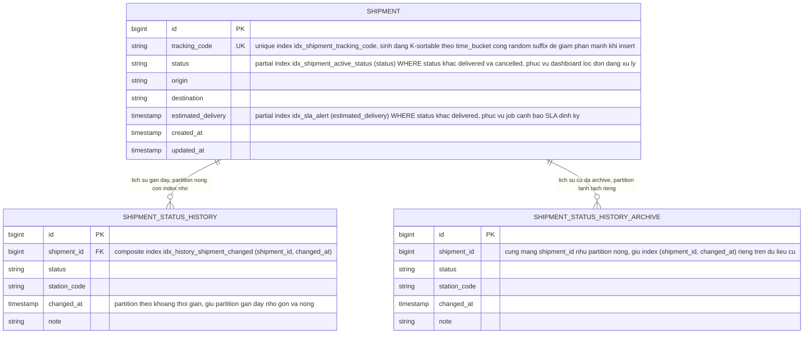

# Enhance ERD - Tối ưu index cho vận đơn tần suất ghi cao

Đây là **enhance**: cùng 2 bảng `shipments` và `shipment_status_history` như base, nhưng bổ sung: partial index cho status "đang xử lý" (thay vì index toàn bộ trạng thái), composite index (shipment_id, changed_at) cho lịch sử, index riêng phục vụ truy vấn cảnh báo SLA, chiến lược tracking_code thân thiện với index khi insert, và tách partition nóng/lạnh cho lịch sử để archive dữ liệu cũ mà không ảnh hưởng index đang phục vụ dữ liệu gần đây.

