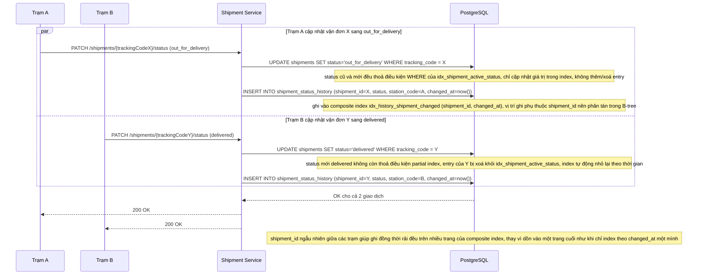

# Enhance - Flow trạm cập nhật trạng thái vận đơn

Đây là **enhance** của flow **update-shipment-status**. So với base, flow này thay đổi ở 3 điểm: (1) UPDATE status giờ tương tác với partial index idx_shipment_active_status - entry chỉ tồn tại khi status còn "đang xử lý" và tự động bị xoá khỏi index khi chuyển sang delivered, (2) INSERT lịch sử ghi vào composite index (shipment_id, changed_at) thay vì bảng không có index chuyên biệt, (3) vì shipment_id là cột dẫn đầu của composite index, các trạm khác nhau ghi vào các vị trí khác nhau trong B-tree, giảm tranh chấp trang nóng so với base.

