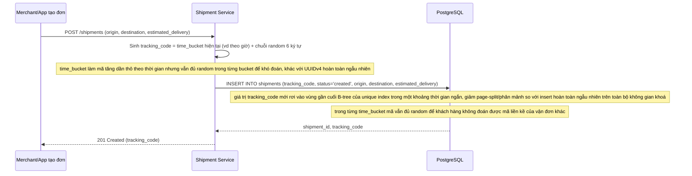

# Enhance - Flow tạo vận đơn mới với tracking_code thân thiện index

Đây là **enhance**, sequence diagram cho flow mới **create-shipment**: tạo vận đơn và sinh mã tracking_code. Base đã có unique index trên tracking_code nhưng không mô tả cách sinh mã; flow này được thêm để làm rõ chiến lược sinh mã mới - vừa khó đoán vừa hạn chế phân mảnh index khi insert liên tục với tần suất cao, đúng yêu cầu đầu tiên của đề bài.

