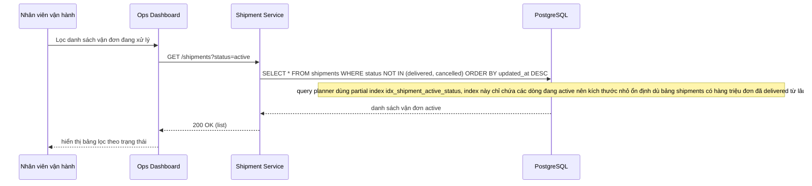

# Enhance - Flow dashboard vận hành lọc vận đơn theo trạng thái

Đây là **enhance**, sequence diagram cho flow mới **filter-active-shipments-dashboard**: bộ phận vận hành lọc danh sách vận đơn đang xử lý. Flow này hoàn toàn mới so với base (base chưa có index nào phục vụ lọc theo status), được thêm để minh hoạ trực tiếp partial index idx_shipment_active_status giải quyết yêu cầu thứ hai của đề bài.

