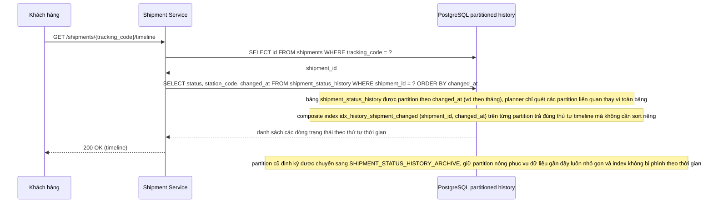

# Enhance - Flow khách xem timeline lịch sử vận đơn

Đây là **enhance**, sequence diagram cho flow mới **view-shipment-timeline**: khách hàng xem toàn bộ lịch sử thay đổi trạng thái theo đúng thứ tự thời gian. Flow này hoàn toàn mới so với base (base chưa có index hỗ trợ truy vấn timeline hiệu quả), được thêm để minh hoạ composite index (shipment_id, changed_at) và chiến lược partition nóng/lạnh giải quyết yêu cầu thứ ba của đề bài.

