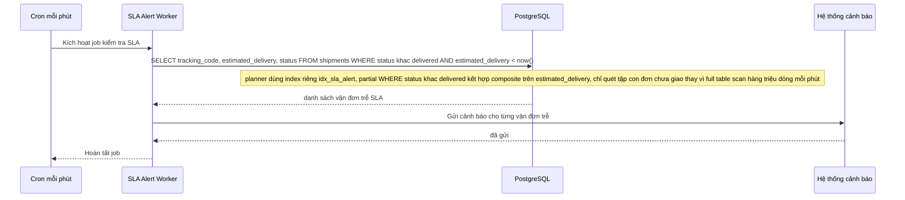

# Enhance - Flow job định kỳ tìm vận đơn trễ SLA

Đây là **enhance**, sequence diagram cho flow mới **sla-alert-job**: job chạy định kỳ mỗi phút để tìm các vận đơn đã quá estimated_delivery nhưng chưa delivered. Flow này hoàn toàn mới so với base (base chưa có index nào phục vụ dạng truy vấn này), được thêm để minh hoạ index riêng cho cảnh báo SLA giải quyết yêu cầu thứ tư của đề bài.

