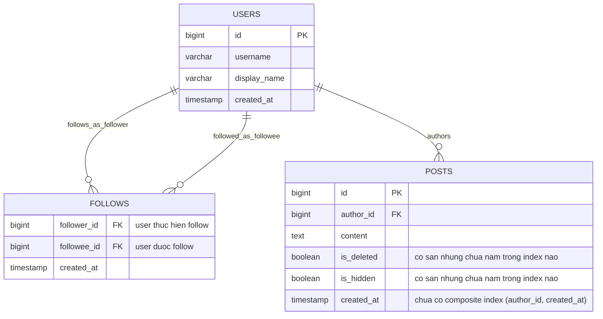

# ERD - Base (trước khi tối ưu index cho newsfeed)

Đây là trạng thái **base**: mô hình dữ liệu tối thiểu để một mạng xã hội có newsfeed theo follow tồn tại, trước khi áp bất kỳ tối ưu index nào. Chỉ gồm `users`, `follows` (quan hệ hai chiều) và `posts` với các cột trạng thái `is_deleted`/`is_hidden` cơ bản (đã có nhưng chưa được đưa vào index) - đây chính là phần dữ liệu mà đề bài (enhance) sẽ tác động trực tiếp.

