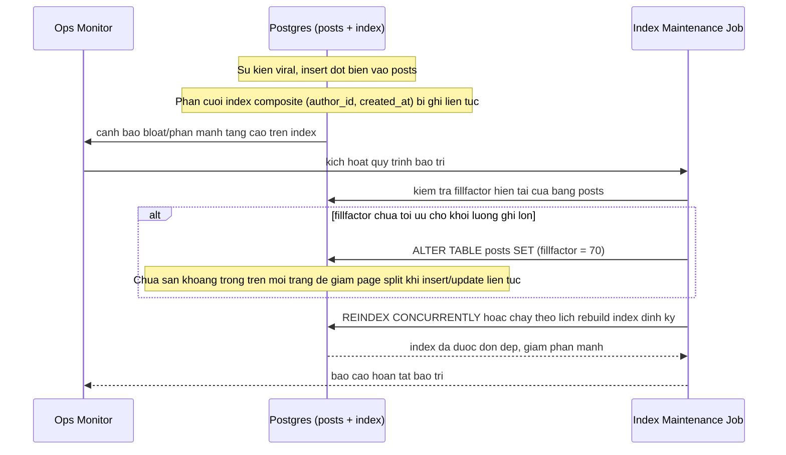

# Sequence Diagram - Enhance: Bảo trì index khi sự kiện viral

Đây là flow hoàn toàn mới phát sinh từ enhance, chưa tồn tại ở base. Flow này giải quyết vấn đề đề bài nêu: ở các sự kiện viral, lượng insert đột biến vào `posts` khiến phần cuối index theo `created_at` bị ghi liên tục dẫn tới page split và phân mảnh, nên cần tuning `fillfactor` và/hoặc lịch bảo trì/rebuild index định kỳ.

