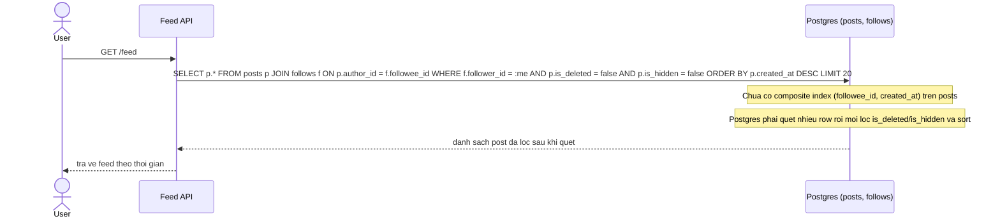

# Sequence Diagram - Base: Xem newsfeed

Đây là trạng thái **base**, flow "xem newsfeed" bằng pull-query đơn giản: JOIN `follows` với `posts`, lọc `is_deleted`/`is_hidden` và sắp xếp theo `created_at` mà chưa có composite/partial index hỗ trợ. Flow này được chọn vì đây chính là truy vấn mà toàn bộ đề bài (enhance) nhắm tới tối ưu.

