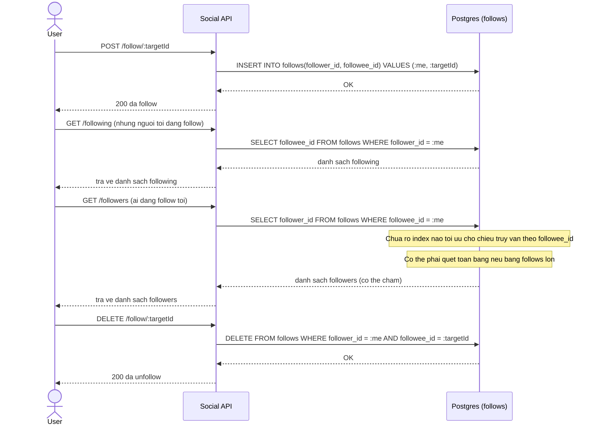

# Sequence Diagram - Base: Follow / Unfollow

Đây là trạng thái **base**, flow "follow/unfollow" và truy vấn bảng `follows` theo cả hai chiều (tôi follow ai, ai follow tôi) khi chưa quyết định thứ tự cột index. Flow này được chọn vì đề bài đặt thẳng câu hỏi nên đánh index `(follower_id, followee_id)` hay ngược lại, và base cần cho thấy vấn đề khi chỉ có (hoặc chưa có) index tối ưu cho một chiều.

