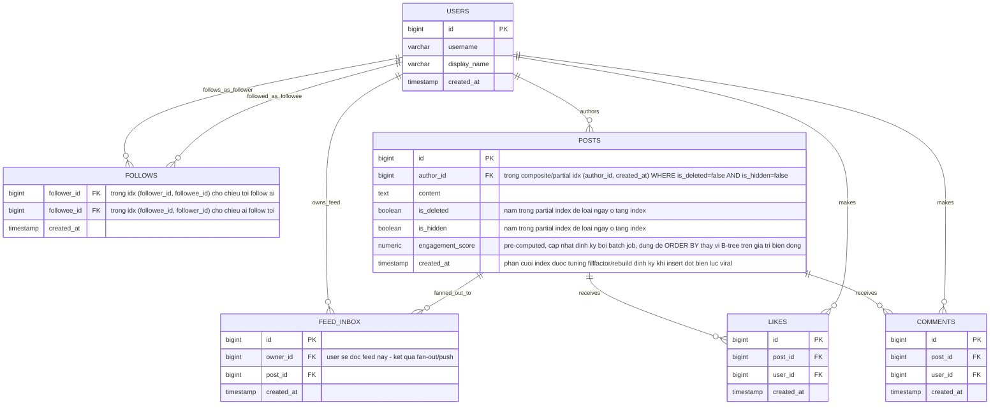

# ERD - Enhance (sau khi tối ưu index cho newsfeed)

Đây là trạng thái **enhance**: giữ nguyên `users`, `follows`, `posts` từ base, cộng thêm những gì đề bài yêu cầu - composite/partial index trên `posts` gồm cả `is_deleted`/`is_hidden`, index cho cả hai chiều của `follows`, cột `engagement_score` pre-computed thay vì sort real-time, và bảng `feed_inbox` phục vụ mô hình fan-out/push khi pull-query không còn đủ nhanh (follow quá nhiều người hoặc theo dõi celebrity). `likes`/`comments` chỉ được thêm ở mức tối thiểu vì là nguồn dữ liệu đầu vào để tính `engagement_score`.

So với base: `posts` thêm cột `engagement_score` và được đánh composite/partial index gồm cả `is_deleted`/`is_hidden`; `follows` được đánh index cho cả hai chiều; thêm mới `feed_inbox` (mô hình push cho trường hợp vượt ngưỡng pull-query) và `likes`/`comments` (nguồn tính engagement score).
