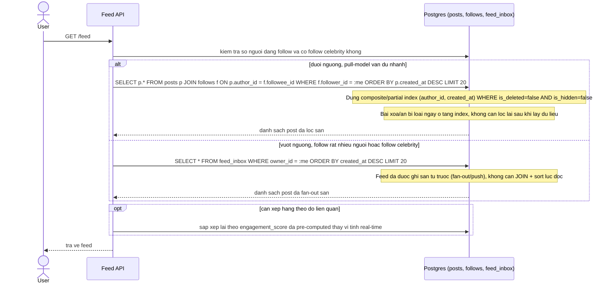

# Sequence Diagram - Enhance: Xem newsfeed

Đây là trạng thái **enhance** của flow "xem newsfeed" đã có ở base. So với base, flow này thay đổi ở: (1) dùng composite/partial index `(author_id, created_at) WHERE is_deleted=false AND is_hidden=false` nên bài xoá/ẩn bị loại ngay ở tầng index thay vì lọc sau khi quét, (2) có nhánh kiểm tra ngưỡng để quyết định tiếp tục pull-query hay đọc từ `feed_inbox` đã fan-out sẵn khi user follow quá nhiều người hoặc follow celebrity, (3) có thể sắp theo `engagement_score` pre-computed thay vì tính real-time.

