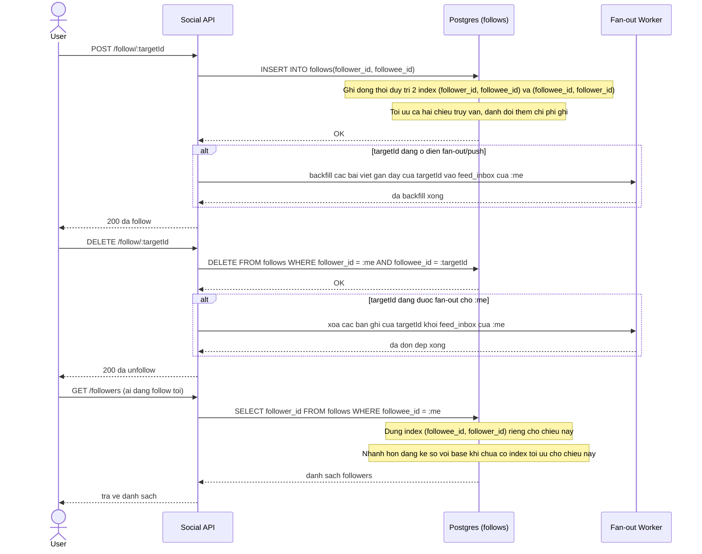

# Sequence Diagram - Enhance: Follow / Unfollow

Đây là trạng thái **enhance** của flow "follow/unfollow" đã có ở base. So với base, flow này thay đổi ở: bảng `follows` nay duy trì index cho cả hai chiều `(follower_id, followee_id)` và `(followee_id, follower_id)` đánh đổi lấy chi phí ghi, đồng thời nếu người được follow đang ở diện fan-out/push thì follow/unfollow còn phải backfill hoặc dọn dẹp `feed_inbox` tương ứng.

