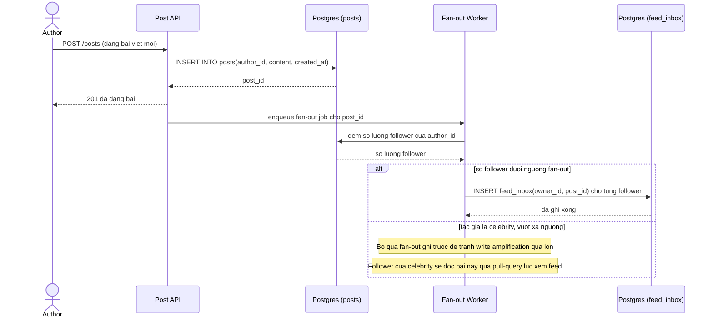

# Sequence Diagram - Enhance: Đăng bài và fan-out ghi feed

Đây là flow hoàn toàn mới phát sinh từ enhance, chưa tồn tại ở base. Flow này thể hiện ngưỡng chuyển từ pull-query sang mô hình fan-out/push mà đề bài đặt ra: khi số follower dưới ngưỡng, hệ thống ghi sẵn bài viết vào `feed_inbox` của từng follower ngay lúc đăng bài (đánh đổi write amplification để đọc feed nhanh); khi tác giả là celebrity có quá nhiều follower, bỏ qua fan-out ghi trước và để pull-query xử lý lúc đọc (mô hình hybrid).

