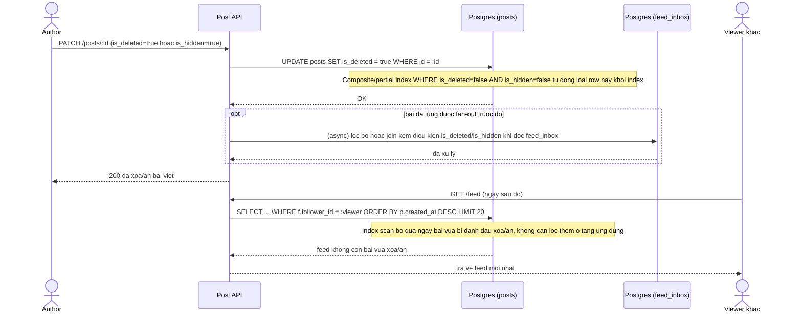

# Sequence Diagram - Enhance: Xoá / ẩn bài viết

Đây là flow hoàn toàn mới phát sinh từ enhance, chưa được vẽ riêng ở base. Flow này thể hiện trực tiếp yêu cầu "bài viết bị xoá hoặc ẩn phải biến mất khỏi feed ngay lập tức" nhờ `is_deleted`/`is_hidden` đã nằm trong composite/partial index, nên không còn phải lọc lại sau khi quét dữ liệu như ở base.

