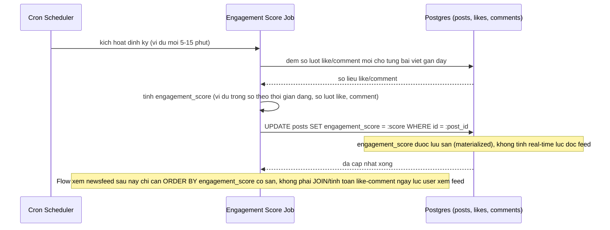

# Sequence Diagram - Enhance: Batch job tính engagement score

Đây là flow hoàn toàn mới phát sinh từ enhance, chưa tồn tại ở base. Flow này giải quyết vấn đề đề bài nêu: khi feed cần xếp hạng theo mức độ liên quan, điểm số biến động liên tục theo like/comment mới khiến B-tree index không tối ưu để sort real-time, nên cần một batch job định kỳ pre-computed `engagement_score` thay vì tính lúc đọc feed.

